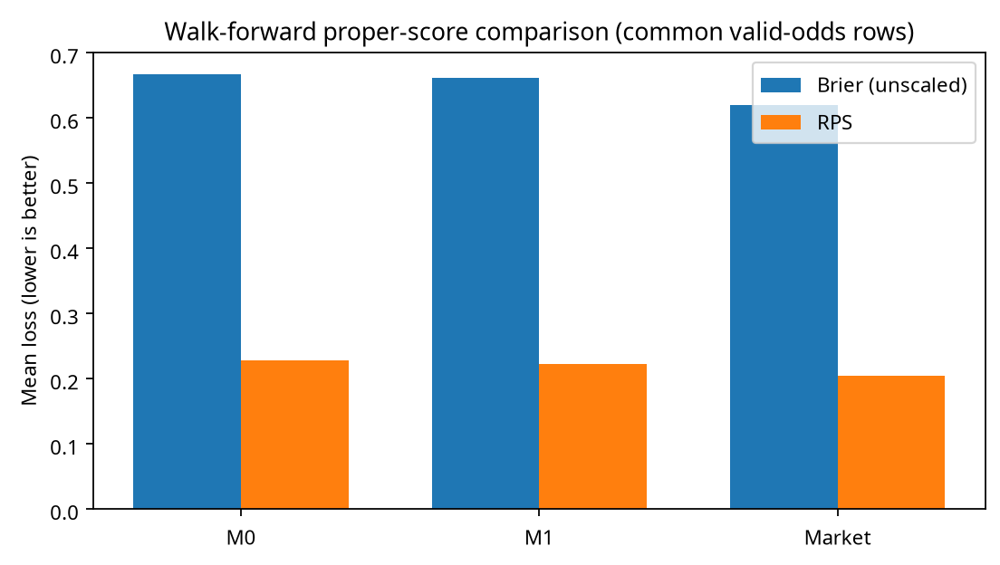
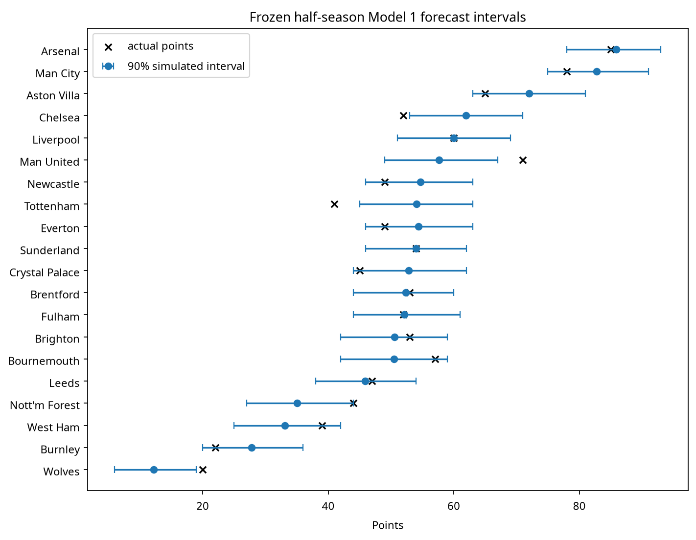
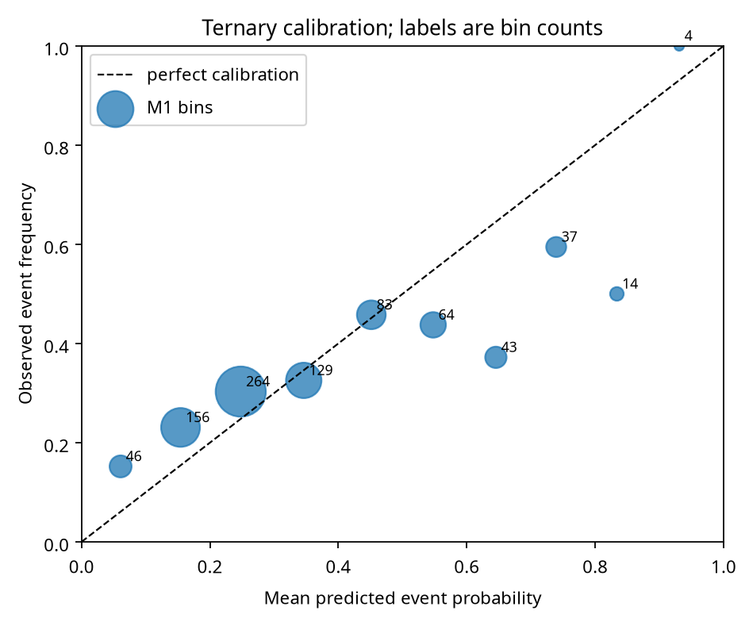

# Calling the Table — historical results and verification

**MATH 3315 · Implementation / analysis draft**  
**QA Lead:** Ankit Karki  
**Prepared:** October 2, 2026  
**Status:** Computed core results. Not a claim of instructor sign-off, Ankit's personal manual review, or final Part 2 rubric compliance.

## Executive finding

The venue-specific team model was slightly better than the league-average model on point estimates, but the paired confidence intervals include zero. **This one-season study does not establish a reliable improvement.** The market-average closing-odds benchmark scored better than both goals-only models, with the caveat that it includes information available closer to kickoff.

The frozen halfway season simulation gave final-points predictions with a **5.358-point mean absolute error** and covered **16 of 20 actual team totals** in its nominal 90% intervals. Four misses illustrate the limitations of static independent-Poisson rates.

## 1. Data and chronology

The frozen football-data.co.uk 2025/26 file passed complete-season validation:

- **380 completed fixtures; 20 teams.** Every directed pairing appears once; each team has 19 home and 19 away matches.
- Match dates range from **August 15, 2025 to May 24, 2026**.
- Full-season home/away goal means are **1.5263 / 1.2237**. These descriptive values were not used to fit earlier predictions.
- Local source SHA-256: `3e3a8352f9ada6789c508d6ca184424421fed56a30400904a4a327c583407e62`.
- The final historical snapshot is the unmodified browser-downloaded CSV; its data were checked against the extraction fallback before analysis. Live data provenance differs and is recorded separately.
- Provider raw CSVs are excluded from the public GitHub repository. A private coursework ZIP contains the delivered local snapshots; consult the provider's use notice before any other use.

Each evaluated match used **strictly earlier dates**. After a 100-match warm-up, **280 matches** were evaluated. The fixed `AvgCH/AvgCD/AvgCA` triplet was valid for all 280 evaluated matches; no market rows were excluded in this run. Pinnacle columns were deliberately not used because of the provider's stale-API warning.

## 2. Probabilistic scores

Brier is the unscaled three-outcome sum of squared errors. RPS uses outcome order H/D/A and is divided by two. Lower scores are better.

| Model | Evaluated matches | Mean Brier | Mean RPS |
| --- | --- | --- | --- |
| M0 — league-average Poisson | 280 | 0.667304 | 0.228289 |
| M1 — team-strength ratios | 280 | 0.661714 | 0.222924 |
| Market — normalized AvgC closing odds | 280 | 0.620037 | 0.204016 |

The contrast is **M0 minus M1**, so a positive number favors Model 1. Paired date-block bootstrap, 2,000 replicates:

| Metric | Mean difference | 95% interval | Interpretation |
| --- | --- | --- | --- |
| Brier | +0.005590 | −0.031277 to +0.042015 | Interval includes zero. |
| RPS | +0.005366 | −0.010215 to +0.021621 | Interval includes zero. |

Do not describe this as a proven advantage. A confidence interval including zero is not proof of equality either. This is one historical season, not a broad multi-season assessment.



The market is a contextual comparison, not an equal-information experiment. Proportional inverse-odds normalization removes the simple sum-over-one margin but does not guarantee unbiased probabilities.

## 3. Halfway season forecast

The complete-date halfway boundary was **January 1, 2026**, with **190 played matches** and **190 remaining fixtures**. Model 1 was fit and frozen at that boundary. The run simulated 10,000 seasons with seed 3315, accumulating points, goals for, and goals against. Future pairings were known retrospectively; their actual goals/results were not used in fitting.

**Points MAE: 5.358. Actual 90% interval coverage: 80.0% (16/20).** Intervals are conditional on the fitted rates and omit parameter/structural uncertainty.

| Team | Expected points | 90% interval | Actual points | Inside? |
| --- | --- | --- | --- | --- |
| Arsenal | 85.884 | 78–93 | 85 | Yes |
| Man City | 82.760 | 75–91 | 78 | Yes |
| Aston Villa | 72.022 | 63–81 | 65 | Yes |
| Chelsea | 61.947 | 53–71 | 52 | **No** |
| Liverpool | 59.982 | 51–69 | 60 | Yes |
| Man United | 57.664 | 49–67 | 71 | **No** |
| Newcastle | 54.679 | 46–63 | 49 | Yes |
| Tottenham | 54.085 | 45–63 | 41 | **No** |
| Everton | 54.349 | 46–63 | 49 | Yes |
| Sunderland | 53.978 | 46–62 | 54 | Yes |
| Crystal Palace | 52.835 | 44–62 | 45 | Yes |
| Brentford | 52.346 | 44–60 | 53 | Yes |
| Fulham | 52.151 | 44–61 | 52 | Yes |
| Brighton | 50.599 | 42–59 | 53 | Yes |
| Bournemouth | 50.462 | 42–59 | 57 | Yes |
| Leeds | 45.914 | 38–54 | 47 | Yes |
| Nott'm Forest | 35.041 | 27–44 | 44 | Yes |
| West Ham | 33.138 | 25–42 | 39 | Yes |
| Burnley | 27.761 | 20–36 | 22 | Yes |
| Wolves | 12.189 | 6–19 | 20 | **No** |

Row order follows expected simulated rank, not simply descending mean points. Expected rank and mean points summarize different distributions. Ties remaining after points/GD/GF use average ranks and fractional boundary weights, not the official head-to-head procedure. Top-four probability is not a universal guarantee of European qualification.



The misses are informative: Chelsea and Tottenham finished below their simulated intervals; Man United and Wolves finished above them. This is consistent with limitations of frozen rates, but the study does not identify a causal explanation for each miss.

## 4. QA evidence

**38 automated tests passed** on the final package, covering data validation, probability orientation/normalization, zero rates, date leakage, proper-score definitions, simulations, seed repeatability, and optional live-log chronology/probability validation.

| Check | Observed evidence |
| --- | --- |
| Maximum adaptive omitted mass | 9.668 × 10⁻⁹, below 10⁻⁸. |
| Selected fixture grid / Skellam discrepancy | 4.111 × 10⁻¹². |
| Same-seed match sampling | Identical output in the tested environment. |
| Season points conservation | Passed: each remaining fixture contributes 3 total points, or 2 for a draw. |
| Five spreadsheet rate calculations | Independently expressed formulas recalculated in LibreOffice; rate differences below 0.0005 for all five. This is software cross-check evidence, not Ankit's personal signature. |
| Pooled goal-count diagnostic | Sparse bins pooled; refitted-lambda parametric bootstrap, 1,000 replicates; p = 0.2837. Exploratory league-wide marginal fit, not proof of team independence or predictive accuracy. |

The calibration figure pools home/draw/away event probabilities; bin labels report the number of event predictions. A single match contributes three related event probabilities, so these are not 840 independent matches. Sparse bins deserve caution.



### Worked rate examples

For the home rate, multiply the home scoring mean by the away conceding mean and divide by the league home mean. Mirror the formula for away goals. The workbook supplies goal sums/counts, not merely precomputed rates.

| Prediction date | Fixture | Training matches | Home lambda | Away lambda |
| --- | --- | --- | --- | --- |
| Nov 8, 2025 | Tottenham–Man United | 100 | 1.290323 | 1.061947 |
| Dec 22, 2025 | Fulham–Nott'm Forest | 169 | 1.630974 | 0.761719 |
| Feb 2, 2026 | Sunderland–Burnley | 239 | 2.580512 | 0.786052 |
| Apr 10, 2026 | West Ham–Wolves | 309 | 1.227991 | 0.704642 |
| May 24, 2026 | West Ham–Leeds | 370 | 1.546803 | 1.509218 |

For the first example: league home mean = 155/100 = 1.55; Tottenham home scoring = 5/5 = 1.0; Man United away conceding = 10/5 = 2.0. Thus home lambda = 1.0 × 2.0 / 1.55 = **1.290323**. League away mean = 113/100 = 1.13; Man United away scoring = 6/5 = 1.2; Tottenham home conceding = 5/5 = 1.0; away lambda = 1.2 × 1.0 / 1.13 = **1.061947**.

## 5. Independent table comparison — partial evidence, not official sign-off

A separately published [NBC final table](https://www.nbcsports.com/premier-league-table-2025-26-season-standings), accessed October 2, 2026, was transcribed with normalized aliases into `qa/Independent_Table_NBC.csv`. The reproducible comparison checks rank, W/D/L, GD, and points.

- **119 of 120 numerical fields agree.** All 20 ranks, W/D/L records, and points agree.
- **Discrepancy:** the NBC article gives Fulham's GD as `4`; the match CSV gives 47 goals for and 51 against, hence **−4**. The publication's sign is a suspected typo but has **not** been silently corrected in the preserved source table.
- NBC does not supply GF/GA in that article. The official Premier League archive and TNT page did not expose their dynamically rendered tables through text extraction.
- **The complete official-table check remains pending.** Ankit should compare an authoritative table's P/W/D/L/GF/GA/GD/Pts and resolve the source discrepancy.

This is an example of why independent QA should retain disagreements rather than claim a perfect match.

## 6. Optional live extension

The inspected 2026/27 results snapshot has 50 completed matches through September 20, 2026. It includes xG columns, intentionally unused in the core. No future fixture list or saved genuine prospective forecast was supplied.

The package can create immutable timestamped fixture logs, reject future as-of dates, recompute prospective status from chronology during scoring, reject malformed probability vectors, and report **prospective-only scores separately** from retrospective demonstrations. This capability has tests; it is **not** a completed live experiment.

Dixon–Coles remains an optional, unimplemented extension. Explicit shrinkage is available as a separate experiment but was **zero** in the reported core run; it must not be tuned on the same test results and then claimed as an untouched validation.

## 7. Reproduction and final readiness

```bash
python -m pip install -e '.[dev]'
python -m pytest -q
python -m standings run --data data/raw/E0_2526.csv --out outputs --seed 3315 --simulations 10000
python scripts/verify_independent_table.py
python scripts/build_qa_workbook.py
```

`outputs/source_metadata.json` records the source hash, seed/settings, and actual runtime versions. `requirements-lock.txt` records the tested direct dependency versions. Spreadsheet cached values require Excel/LibreOffice recalculation after rebuilding.

**Remaining before academic submission:** member names/deadlines, signed group contract, topic uniqueness, meaningful individual Peer Evaluation Forms, instructor proposal sign-off, personal hand-check review, full authoritative table comparison, Part 2 Results Requirements, final class presentation and each student's own reflection. No signatures, approvals, or personal experiences have been invented.

## References

- [Football-Data description, provider conditions, and stale-Pinnacle warning](https://www.football-data.co.uk/data.php).
- [England files](https://www.football-data.co.uk/englandm.php) and [column notes](https://www.football-data.co.uk/notes.txt).
- Maher (1982), *Modelling association football scores*. [DOI](https://doi.org/10.1111/j.1467-9574.1982.tb00782.x).
- Dixon and Coles (1997), *Modelling association football scores and inefficiencies in the football betting market*. [University citation](https://eprints.lancs.ac.uk/id/eprint/19492/).
- The three original course PDFs in the repository; Part 2 Results Requirements was not supplied.
